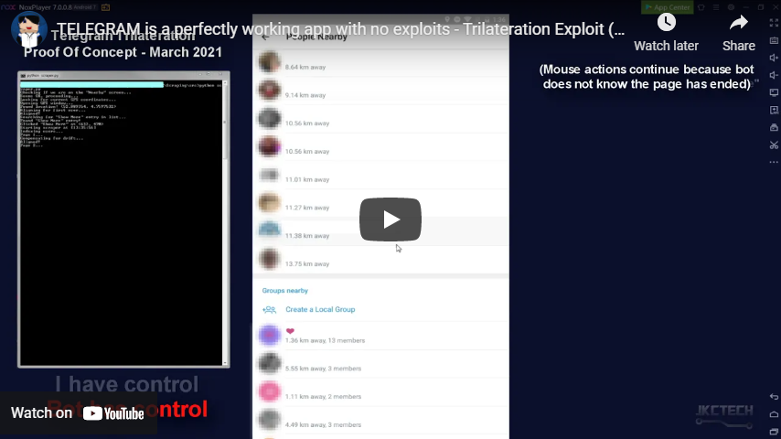
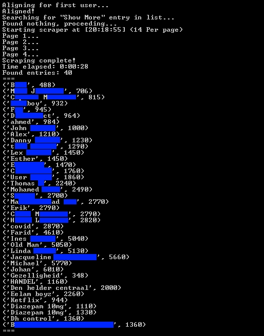
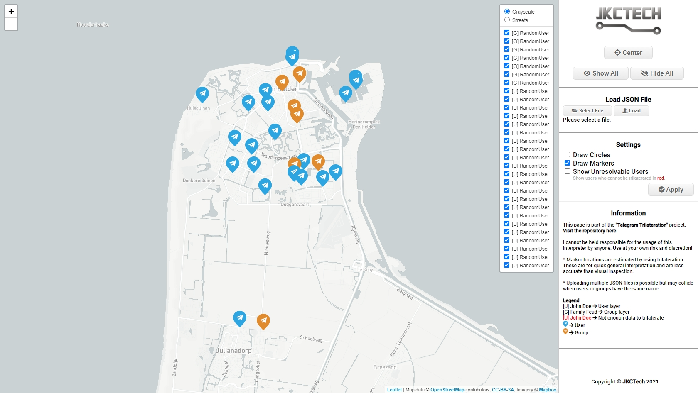

# Telegram Trilateration

## 🎉 Telegram Finally listened! 🥳

It took them over a **YEAR** to realize their mistake but they **FINALLY** lowered the accuracy of the "People Nearby" function.
Or it might be that the huge sudden **outburst of negativity from Russian and Ukrainian media** has finally made them come to senses ¯\\\_(ツ)_/¯

Either way, when you run the function now, you will only see results of `500m`, `1km`, `2km`, etc.
I have little faith left in Telegram when it comes to privacy and taking issues seriously.
This repository will stay online, but be adviced that none of the data collection methods in here will work as expected.

### Some posts about this repository:

[UA] (<a href="https://focus.ua/uk/digital/507002-vychislyat-dazhe-prezidenta-telegramm-pozvolyaet-uznat-koordinaty-lyudeyu-s-tochnostyu-do-metra">Focus.ua</a>) Вирахують навіть президента: Telegram дозволяє дізнатися координати людей із точністю до метра

[RU] (<a href="https://zoom.cnews.ru/news/item/544035">CNews.ru</a>) Telegram превратился в легальное средство слежки за передвижениями пользователей

[RU] (<a href="https://habr.com/ru/post/652015/">Habr.com</a>) Telegram позволяет узнавать координаты людей с точностью до метра

[EN] (<a href="https://os2int.com/toolbox/applying-effective-osint-to-geo-monitor-russian-military-activity/">OS2INT.com</a>) APPLYING EFFECTIVE OSINT TO GEO-MONITOR RUSSIAN MILITARY ACTIVITY

<hr>

## ✨ UPDATE: API method

Turns out Telegram offers the possibility to request people nearby using their API. This means what the entirety of the **"Scraping"** section in this repository became obsolete... *Sigh...*

Doing this requires about ~30 lines of code, instead of the spaghetti mountain I created by making an entire **OPTICAL OCR SCRAPER AND PARSER**... What was I thinking anyway?

**TL;DR**: I made a new script that can do the same thing, only much better and more stable.

<h3><a href="API/">Read More ></a></h3>

<hr>


### ⚠️ Disclaimer
```
I have tried reaching out to Telegram via email. (Feb 22th 2021)
After more than 1 month of no reply, I decided to open up this repository.
```
**I AM NOT ACCOUNTABLE FOR ANY DAMAGE OR ILLEGAL ACTIVITY DONE BY END USERS! USE AT YOUR OWN RISK AND DISCRETION!**

A while back, Telegram rolled out a new (Opt-in) feature which allows users to find people and groupchats close to their location. This "Feature" allows you to see the relative distance between you and a user **in meters!** By abusing that data we are able to pinpoint someone's general location.

**When this feature is enabled, you will see this general warning:**


Which is, in my opinion, an understatement.

---

## See the scraper and webviewer in action
[](https://www.youtube.com/watch?v=Vgoq8Lp8PUs& "TELEGRAM is a perfectly working app with no exploits - Trilateration Exploit (Stealing locations)")

---

## Table of Contents
* [Trilateration](#trilateration) (Finding someone's location)
* [Scraping](#scraping) (Automating the trilateration & Tools)
* [Webview](#webview) (Using the scraped data)
* [Other Concerns](#other-concerns)
* [The Solution](#the-solution)

---

### Trilateration
A great example of why this new feature is a problem is trilateration.
([Not to be confused with triangulation](https://gis.stackexchange.com/questions/17344/differences-between-triangulation-and-trilateration))

Using this technique combined with GPS spoofing, we can determine a user's whereabouts by taking multiple samples of locations and distances relative to our own location.

<a href="Trilateration/"></a>
<h5><a href="Trilateration/">Read More ></a></h5>

---

### Scraping (Obsolete)

Locating someone by hand takes time (A few minutes) and effort (Clicking and typing). It will probably take you +-30 minutes to track someone by hand.
So naturally, I spent weeks of effort into automating this system to save myself minutes of time...

<a href="Scraping/"></a>
<h5><a href="Scraping/">Read More ></a></h5>

---

### Webview

Gathering the data through scraping is fun and all, but actually being able to interpret it is better.\
**(I took this way too far, please don't ever be like me)**

<a href="Webview/"></a>
<h5><a href="Webview/">Read More ></a></h5>


---

### Other Concerns

Other than users, groupchats can also be indexed by location. You have to create a group specifically for this purpose so when you create one, you probably realize everyone can read along with the chats, but some of the people who join by invite for example won't.

The contents of the groupchat can be seen by anyone without actually joining which is literally spying.

Using this, it's not hard to find groups where people sell illegal goods / services or find private information.

"*Anyone who wants to buy some good weed?*"


This is already being used **A LOT** by bots. Go have a look yourself, open up some random groups and I almost guarantee it will show you lots of **_"Hot single ladies who are looking for a good time"_** with very questionable pictures...

On another note, finding user information on Telegram is not difficult. It's expected that people see your profile, regardless of using the "Nearby" function or just using the search feature. The problem here is by using location search you gain much more information and are able to just "browse" for people.

By finding someone, you can see their profile picture(s), bio and username. _(Depending on their privacy settings)_

Being able to see someone's profile on a "search engine" is to be expected and key to it's functionality but being able to find people this way could open up a doorway for stalkers to find someone or just lurk for random people without them knowing their phonenumber or Telegram username.


---

### The Solution

<!-- Don't blame me for making a meme out of this... -->
# PLEASE TELEGRAM, JUST ROUND THE DISTANCES TO WHOLE KILOMETERS...

There is literally no good reason to show random people a distance **THIS** accurate...
(Was not so hard after all, was it?)

