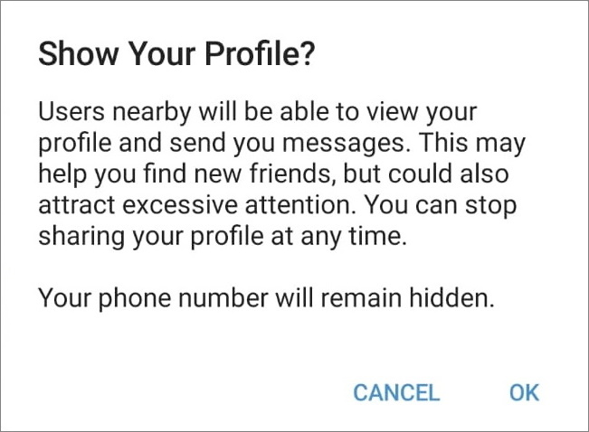
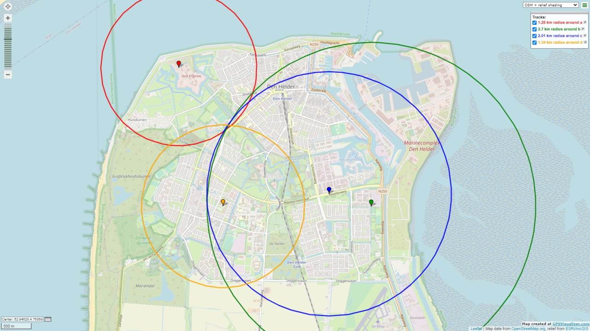
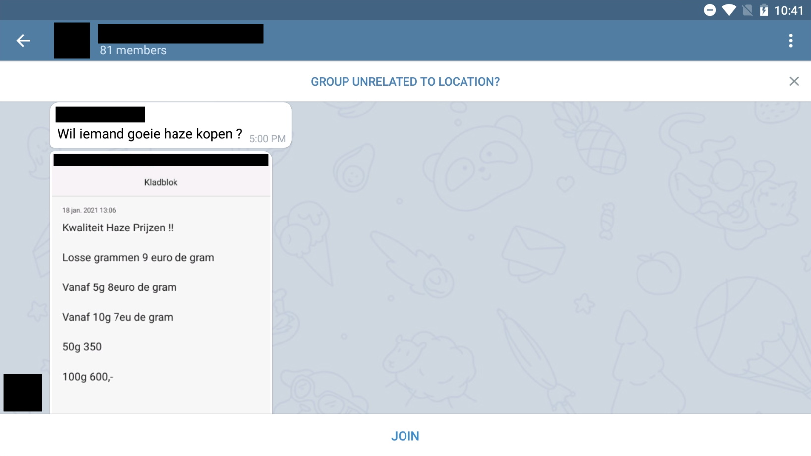

# Abusing Telegram's "People Nearby" Feature

A while back, Telegram rolled out a new feature which allows users to find people and groupchats close to their location. This opens up a big security risk for all people who enable it since most won't realize they can be traced using this method.

When this feature is enabled, you will see this popup on your screen which is not at all telling you about the ACTUAL risks.

The goal of this repository is to explore the possibilities and inform people about the risks of having "Nearby" enabled.

---

## Table of Contents
* [Trilateration](#trilateration) (Finding someone's EXACT location)
* [Public Groups](#public-groups)
* [User Information](#user-information)
<!-- * [Scraping](#scraping) (Automating scanning a whole area) -->

---

### Trilateration
A great example of why this new feature is a problem is trilateration.
([Not to be confused with triangulation](https://gis.stackexchange.com/questions/17344/differences-between-triangulation-and-trilateration))

Using this technique, we can determine a user's whereabouts by taking multiple samples of locations and distances relative to our own location.

This problem could be easily avoided by simply rounding the "Distance to X" field to whole kilometers instead of just 10 meters...

<h5><a href="Trilateration/README.md">Read More ></a></h5>

---

### Public Groups
Other than users, groupchats can also be indexed by location. You have to create a group specifically for this purpose. The creator of the group probably realizes everyone can read along with the chats, but some of the people who join by invite for example won't.

The chats are shown to people who click on the group, even if they don't actually join. The groups are free to join by anyone so even blocking this won't suffice, but at least you KNOW that someone has read the chat.

Using this, it's not hard to find groups where people sell illegal goods / services or find private information.

---

### User Information
In general, finding user information on Telegram is not difficult and it's expected that people see your profile, regardless of using the "Nearby" function or just username searching. The problem here is by using location search you gain much more information in the sense of knowing that persons general whereabouts and thus are able to find a specific person more easily.

By finding someone, you can see their profile picture(s), bio and username. (Depending on their privacy settings)

Being able to see someone's profile on a "search engine" is to be expected and key to it's functionality but being able to find people this way could open up a doorway for stalkers to find someone without them knowing their phonenumber or Telegram username.

<!-- ---

### Scraping

Locating a person takes 5-10 minutes on avarage when doing so by hand. This can theoretically be sped-up (Or at least be made less work) by automating these actions. Imagine moving your GPS location bit by bit over an entire city while collecting all Names, Usernames, Bio's, Pictures, Locations, Distances, Groups (and their Chats, Users and Media) on the go...

<h5><a href="Scraping/README.md">Read More ></a> (Work in progress)</h5></a> -->
