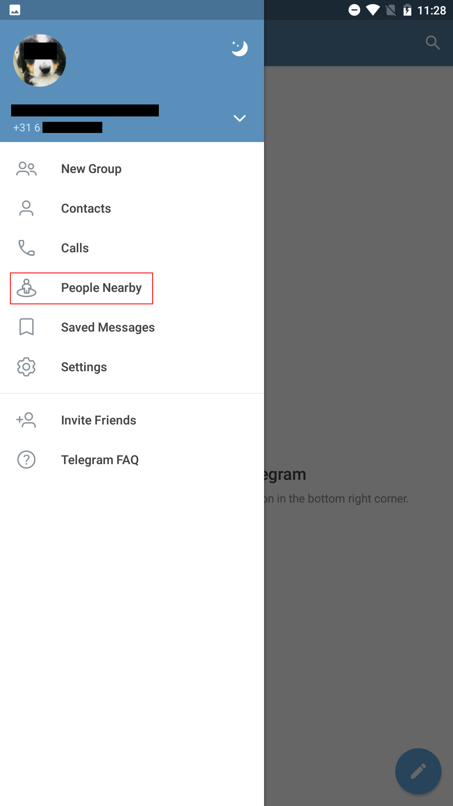
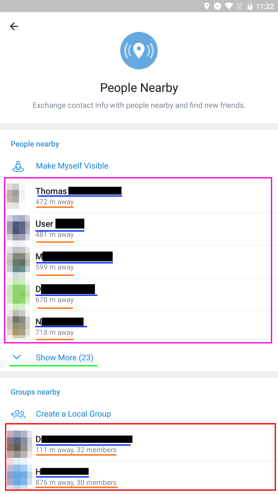
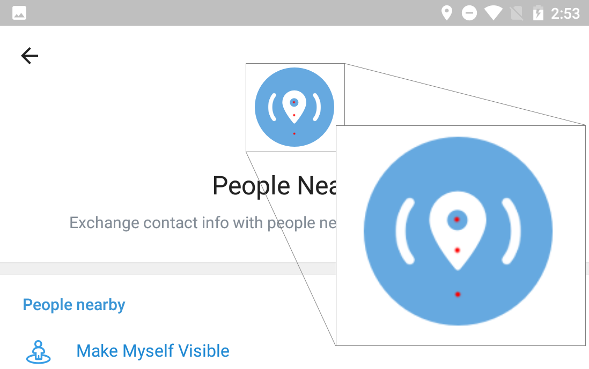
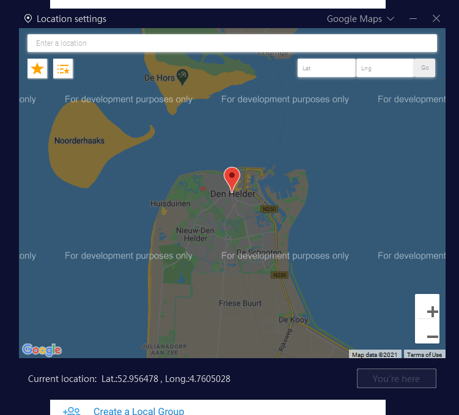
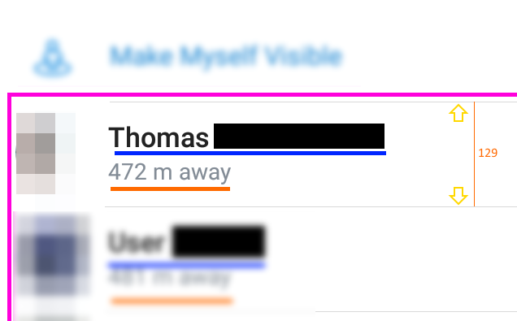
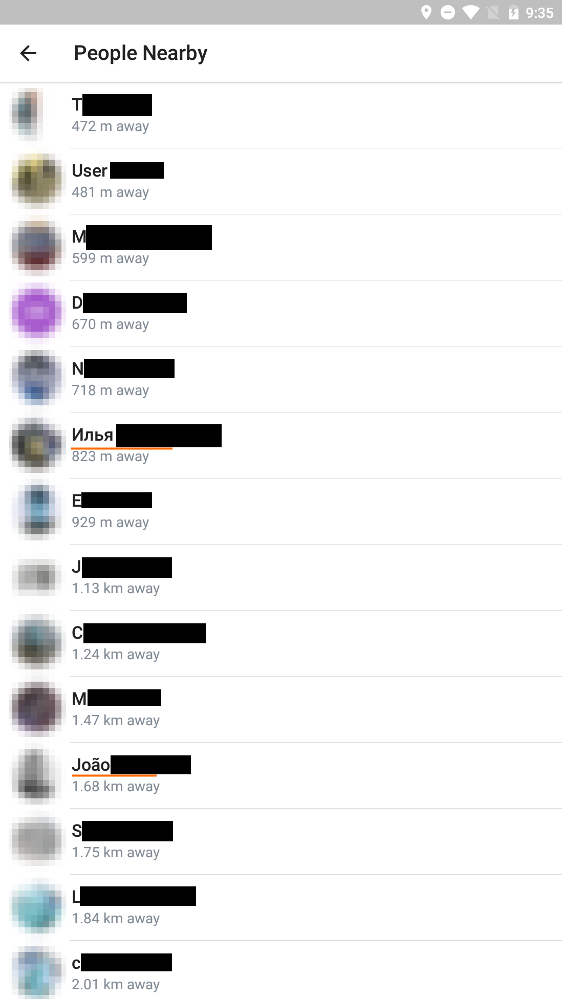
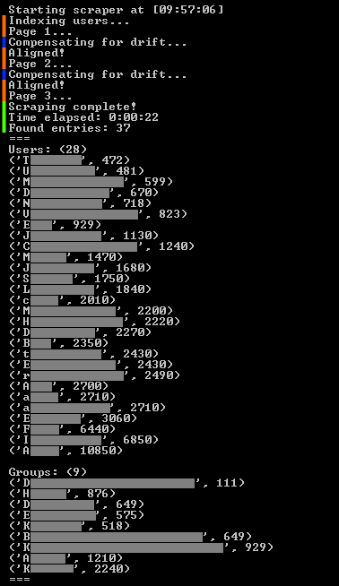
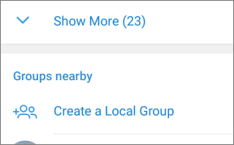
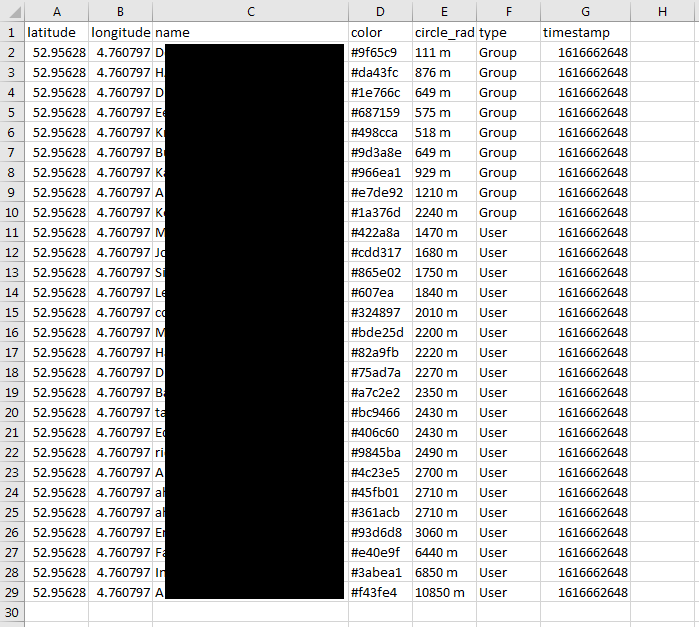

# Scraping

By abusing NOX's GPS spoofing and doing some keyboard, mouse and OCR magic, we can automate tracing users.\
Because who has time for doing this by hand?

---

## Table of Contents
* [Usage](#usage)
* [Theory](#theory)
* [Subtools](#subtools)
* [Known Issues](#known-issues)

---

### Usage

**Do once**: Open `/Scraping/src/utils/settings.py` and edit it's values to suit your screen and Android Emulator.

1. Open Nox
1. Open Nox's GPS window `Ctrl + 9` and move to your preferred location
1. Open Telegram's "People Nearby" page
1. Run `/Scraping/src/scraper.py`
1. Sit back and wait for the scraper to finish.
1. Resulted `.xlsx` files will appear in `/Scraping/src/results`
1. Run the scraper at least 3 times with different GPS positions.
	- When you move to another GPS position, please confirm the data of the "People Nearby" screen actually changes. If you switch positions too quickly Telegram will just remember the old coordinates and not actually move your reference point.
		* In my testing, I could move once after an initial scan and then had to wait for 10-15 minutes before I was moved to the next point.
	- Doing scans from points too close to eachother will result in inaccuracy on targets further away from the center. **(+- 5km worked the best for me)**
	- Doing more scans will not always increase the accuracy of resulted data. Limit your scans to about 5 to prevent calculcations from going all over the place.
1. Process the data according to the [Subtools](#subtools)

**Warning!**\
Doing keyboard / mouse emulation can seriously mess-up your system if things go wrong.\
**I AM NOT ACCOUNTABLE FOR ANY DAMAGE OR ILLEGAL ACTIVITY DONE BY END USERS! USE AT YOUR OWN RISK AND DISCRETION!**\
To abort the scraper, quickly move your mouse to the Top-Left of your screen to trigger the failsafe!

---

### Theory

Almost anything can be automated with software these days. By using [NOX Player](https://www.bignox.com/) as an Android emulator with GPS Spoofing capabilities we can make Telegram think we are at specific locations. By moving ourselves to a location and doing a scan of users + their distances we can collect a dataset which we will use for trilateration. For this theory to work on a user, we need (At least) 3 points of reference.

**This concept is displayed very well in the [Trilateration](/Trilateration) part of this project.**

Okay so we want to scrape the data from the Telegram app. Since I am not very good in Android development, I decided to go the [OCR](https://en.wikipedia.org/wiki/Optical_character_recognition) route. Going this way has it's downsides but we will discuss those later. In this case, we will make use of [PyTesseract](https://pypi.org/project/pytesseract/).

Let's have a look at what we're dealing with inside of Telegram by making a new fresh account and opening **"People Nearby"**.

 

 **Users**
 **Groups**
 **User Unfolder**
 **User / Group names**
 **Distances (+ Members when applicable)**

Looking at this screen we need to accomplish a few things:
1. Confirm everything is well aligned
1. Get current GPS coordinates
1. Unfold the complete list of users
1. Scroll through the list in a controlled manner for scraping
1. Take screenshots of the screen and scrape the characters
1. Determine if entries are Users or Groups
1. Collect & Export

Optionally, I wanted to add support to download the profile pictures for the groups and users but that seemed like a lot of extra work for just a proof of concept so that is a postponed feature.

**Confirm everything is well aligned**
Before doing magic with mouse and keyboard, I want to make sure we are at the correct screen and it looks like stuff is aligned properly. Multiple methods are used for this. Here are some of them:

To make sure Nox is open (at all) and maximized, we use the Win32 API to get access to that window and maximize it. After that, we are sure we can prceed.



In another example, we will be taking samples of some random pixels inside screens, and comparing those to expected values so we can make sure everything is well.

I take 3 samples of pixels around these 3 points. I know they SHOULD be (From top to bottom) `blue`, `white` and `blue`. If this is not the case, the program aborts.

**Get current GPS coordinates**
To perform trilaterations, we need to know from what location the GPS spoofer is operating right now. This can be scanned as well. By emulating some keypresses, we can open the GPS window from Nox:



Here can see the current position and even set a new one if we ever wanted to do so. We use the same OCR engine again, only this time, we have to process the screenshot first. This engine is not made for light text on a dark background, so with some math, we converted that to a black-on-white image. After that, we do some RegEx magic and we have extracted the coordinates.

**Unfold the complete list of users**
As a first obstacle, we need to unfold the complete list of users so we can start scraping without any hiccups. If the "Show More" button is being shown on the screen at all, it will be on the same position every single time. By taking a screenshot of that specific area and looking for "Show More" in the resulted OCR string, we can detect if the list should be unfolded. If so, we simply just click with the mouse there once and we have the complete list on our screen.

**Scroll through the list in a controlled manner for scraping**
Scrolling through the list of chats nearby should not be THAT much of a hassle... Right? By simply dragging our mouse on the screen we can simulate scrolling.

First I created a way for my program to align itself to a specific point on the screen. Every chat has the same height on screen. This is easily spotted by looking at the light grey lines between chats. When I exported this as a screenshot (Using NOX itself), I measured the amount of pixels between those lines. This turned out to be **129 (NATIVE)** pixels. The "Native" in this is important. 



I have configured the emulator to run a higher resolution than my screen itself (About 2x). This is to make more items fit on the screen at once. The downside of this is that when you divide **129** by 2, you get a decimal number. Pixels cannot be divided into decimals, so this presents a problem. At first I didn't expect this issue to be of significance, but in the end this resulted in the alignment of my scraper to drift and miss some critical data. To counter this, the program will re-align itself after every "page" scan. This takes some extra time and can be optimized but for now, this will do.

Scrolling in itself turned out to be an issue as well. You have to move your mouse a certain amount of pixels before the emulator even registers it as a dragging finger. We will call this the **"Scrollbleed"** from now on. After determining the scrollbleed with some tests, I had to sum this to every distance I was about to drag, so this is now fixed.

**Take screenshots of the screen and scrape the characters**
Let's have a look at what a single "page" of users looks like.



Lucky as I am, exactly 14 users fit on my screen at once. This will make it easier to scrape since I can just take my entire screen at once and run it. I also underlined 2 entries in this screenshot. These are examples of names that tend to be an issue with the OCR engine. The first name is in Cyrillic which the OCR engine does not recognise. The second example has a tilde above it. It depends on the mood of the OCR engine if it recognises this or not. There is no easy way to fix both of these issues, so I decided to just... ignore the issues :D

After taking the screenshot, we convert it to grayscrale and crop-off the user pictures because they can contain characters as well and mess-up the scraping. After this, we are left with an alternating list of strings:

```
name
distance
name
distance
name
distance
...
```

By simply looping over those lines we can combine them into objects containing a name and distance. By writing a simple RegEx pattern I checked to see if the distances are really distances and that the OCR didn't mess up. In the same step. I also converted these distance strings into integers and made the distances in meters. So `1.75 km away` becomes `1750` as an integer. I also noticed that users are displayed ordered by distance in ascending order. I used this to loop over all distances and check if they are indeed ordered. If not, I assumed something broke in the meantime and I will error out to prevent corrupted or wrong data.

Now we end up with this outpur from the scraper:



 Represents the scraper taking a screenshot, running the OCR engine and parsing the output.

 Represents the scraper scrolling back a little, after which it will re-align itself to the light-grey line on top of the next-to-scan user.

 Represents the stats and finishing-up.

Here we also see the scraper found out which entries are **groups** and which are **users**.



Whenever the scraper finds the text **"Create a Local Group"** we start marking chats as groups instead of users. The theoretical edgecase in this, is that if someone has the actual name **"Create a Local Group"**, the scraper starts to mess up... The chances of this are slim so again, we will be ingoring this issue.

**Collect & Export**
For the last part, we simply print all the created chat-objects onto an `xlsx` sheet and we should be ready to go. I made the choice to support the [GPS Visualizer](https://www.gpsvisualizer.com/) format because, why not?



We assigned colors by using a random HEX color generator and using the chat's name as the seed. This way, we will get the same color for a chat on different scans.

#### For further processing, see [Subtools](#subtools) and [Webview](/Webview)

---

### Subtools

All tools are located in `/Scraping/src/tools`
I have made some small tools to do the processing of the results of the scraper. The tools that require files as parameters can have files dropped onto them for ease of use.

For example: Drop a `combined.xlsx` onto `resolver.py`

**Mouse Debugger** `python3 mouse.py`
By running this python file, a window will show that will tell your current mouse position + the RGB values of the hovered pixel.
This can be used to find coordinates and / or debug color values used for aligment.

**Combiner** `python3 combiner.py <file1.xlsx, file2.xlsx, ..>`
This file will combine multiple result `.xlsx` files into a single one. This is a simple task that can be done by hand as well, but automation is better.

**Resolver** `python3 resolver.py combined.xlsx`
This file takes the `.xlsx` from the **Combiner** and calculates estimate location using Trilateration. This data will then be exported into a `.json` file which can be read by the <a href="/Webview">Webviewer</a>

---

### Known Issues

**To Fix:**
* Scraper sometimes misaligns on initial align randomly
* `Show more` Randomly not being found
* `GPS Coordinate Scraper` Does not handle negative coordinates very well

**Fixed Isssues:**
-- None, whoops --

**Ignored issues:**
* OCR engine does not handle non-standard characters very well (Emoji's, Arabic, Cyrillic, etc.)
	- Can be fixed by using another OCR engine which is out of the scope of this project.
* Telegram has a cooldown on changing your GPS position **
	- Can be solved by running multiple instances of this program.
* Issues when users / groups have the same name
	- Taking a pixel from the profile pictures as a seed?
