# Trilateration

* [Test 1](#test-1) (Random user)
* [Test 2](#test-2) (Friend with known location)

---

## Test 1

For the first proof of concept test, I picked a random user in the "Near me" list of my actual location in Den Helder.\
The person I picked is called "Clara".

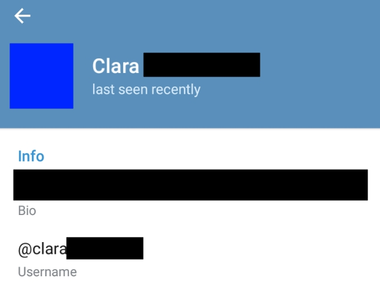

To do a trilateration, I need a tool to do so. I could easily write a tool like this myself but why should I when [https://www.gpsvisualizer.com/](https://www.gpsvisualizer.com/) exists? This website allows to import XLSX format and make it into a circle map using this template:

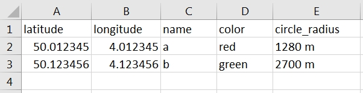

So, how to start pinpointing someone? To determine an exact location of a device, you need at least 3 points with their respective distance. I could either move there myself, or let my computer do the work for me. By using an emulated Android device, I can spoof my GPS location and make Telegram think I am at another location. One Android emulator with GPS spoofing built-in is Nox ([https://www.bignox.com/](https://www.bignox.com/))

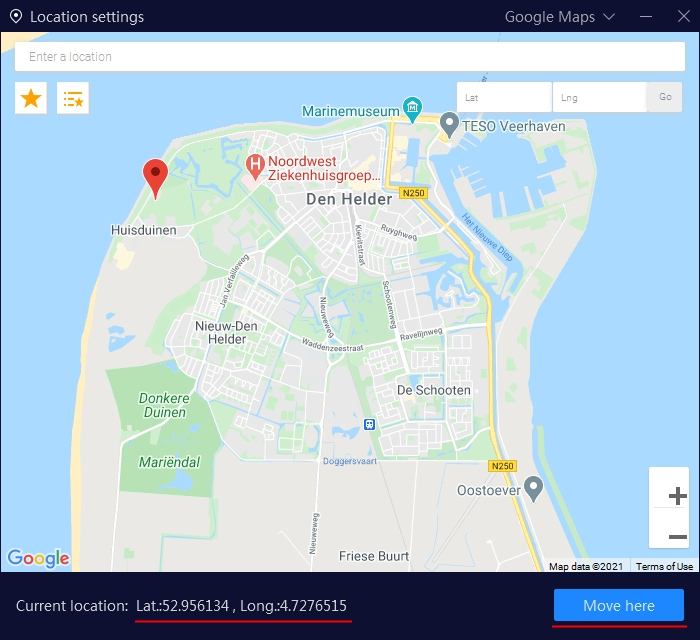

Nox Allows me to click on a spot on the map, click "Move here" and my GPS location is set.\
It provides the exact set GPS coordinates which we will use for our trilateration.

**The steps for locating someone are rather easy:**

1. Find their general location to start your search, let&#39;s say a city for example.
2. Place your GPS marker to a random location.
  1. **Please Note:** Telegram seems to have some sort of rate limiting on how fast you can move from one place to another. As a result, you should make sure your "Near you" list actually updates when you move location. If it does not, wait a bit until it does. This usually takes a couple of minutes. This could theoretically be sped up by doing this as a group which makes it only a matter of minutes to locate a person which is a somewhat scary foresight.
3. See if the user pops up and note the exact coordinates of your pin and the distance to that user.
4. Repeat step 2 and 3 as much as you want (At least 3 times, give or take)
5. Note them in an Excel sheet as in the example.
6. Upload your Excel sheet to [https://www.gpsvisualizer.com/](https://www.gpsvisualizer.com/)
7. Find where all the circles intersect each other, this is the location of the user.

**These are the results of the trilateration:**

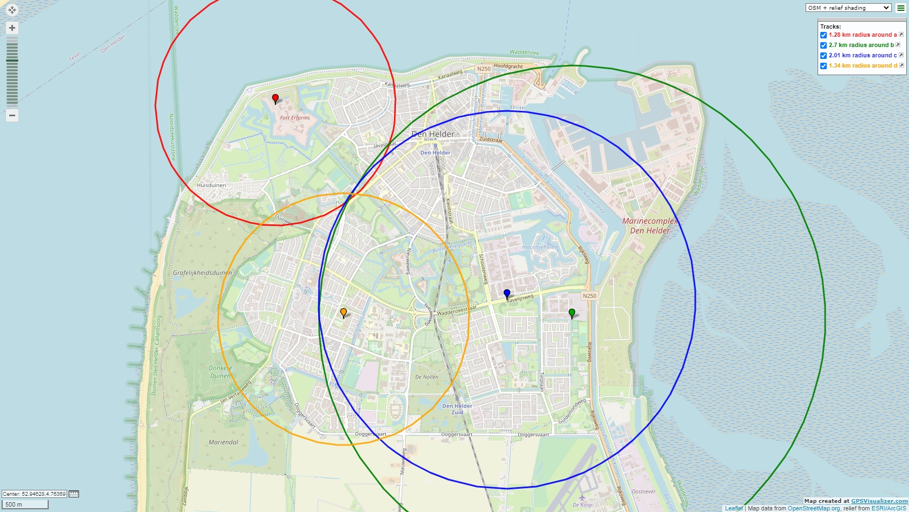
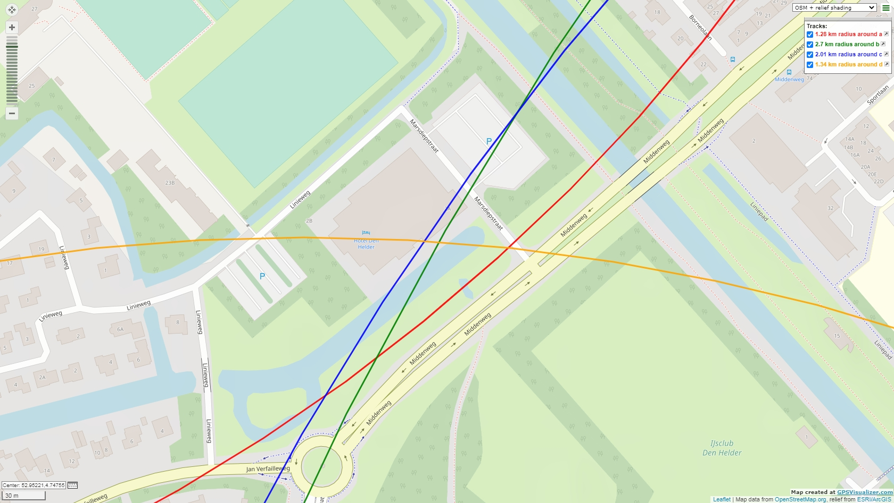

Which leads me to believe with a high degree of certainty that this user is staying in Hotel Den Helder.\
**(Provided they are not also spoofing their location lol)**

---

## Test 2

Since asking a stranger *"Hey, is this where you currently stay?"* seems… you know… odd? I re-did this experiment with a friend of mine. He was currently staying at a random (For me) unknown location in Nijmegen.

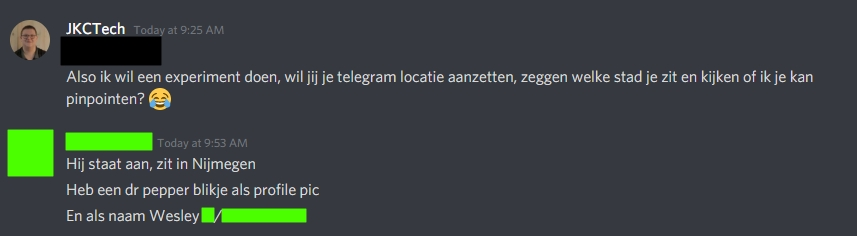

**Me:**
_Also, I want to do an experiment, can you enable your Telegram location for me, tell me which city you are in, and let me see if I can pinpoint you?_

**Him:**
_I enabled it, I am in Nijmegen
 I have a Dr. Pepper can as profile picture
 And as name `Wesley X / @\<username\>`_

Finding him was not very difficult:

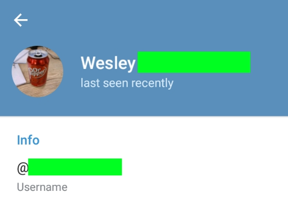

After I found him, I conducted the same test as on the previous example using the exact same steps. This resulted in the following dataset:

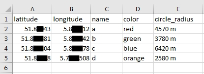

I maked some of the data since the result location is a less common place to stay than in Test 1 where it was a hotel. I will mask some other upcoming information as well. This will probably still be reversable but hey, I did my best.

After creating this dataset, I rendered a map and collected the results. I replaced the background tiles with a texture instead of the actual map.

_(By hosting a local webserver and redirecting all tile domains of mapbox to localhost and hosting 1 single image there, for the curious people)_

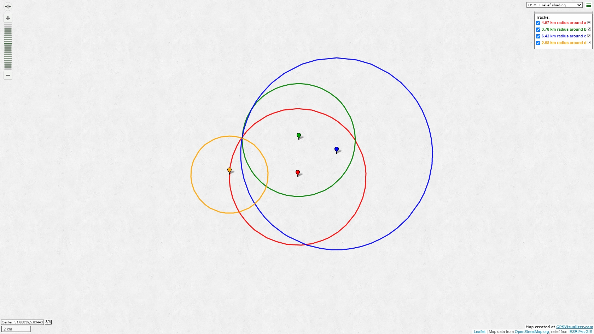
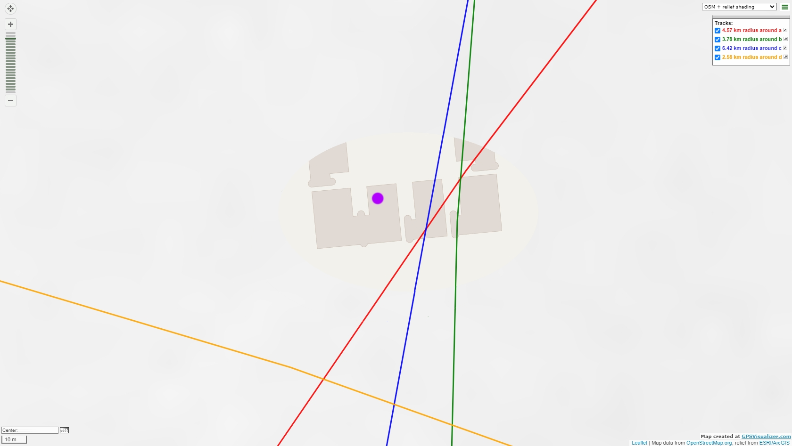

The purple dot marks the real known location of my friend which I got later. This shows that this estimate is actually scary accurate.

Of course, I had to confirm my calculations were correct by asking him if I was right.

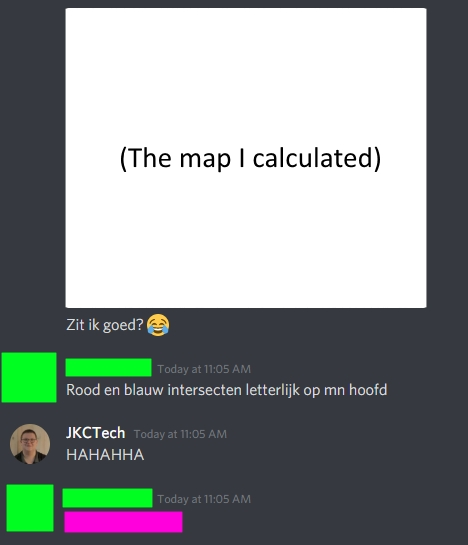

**Me:**
_Am I on the right spot?_

**Him:**
_Red and blue intersect literally on top of my head._

**Me:**
_HAHAHHA_

**Him:**
**\*Gives his actual current location as confirmation\***
